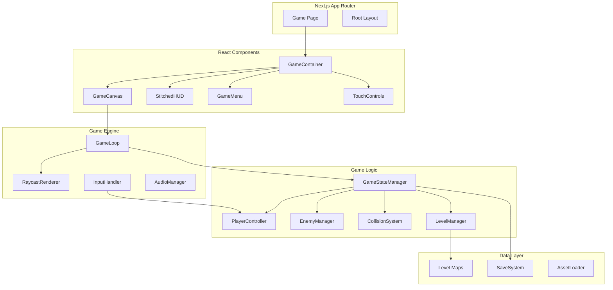

# FrankenKiro Design Document

## Overview

FrankenKiro is a browser-based first-person shooter built with Next.js 14+ App Router, featuring DOOM-style raycasting graphics and a Frankenstein-themed horror aesthetic. The game renders pseudo-3D environments using a JavaScript raycasting engine on HTML5 Canvas, with React managing UI state and game loop orchestration.

The architecture prioritizes:
- Client-side rendering for responsive gameplay
- Modular engine components for maintainability
- Type-safe game state management
- Halloween "stitched together" visual theme

## Architecture



## Components and Interfaces

### Core Engine Components

#### GameLoop
Manages the main game loop using `requestAnimationFrame` with delta time calculation.

```typescript
interface GameLoopConfig {
  targetFPS: number;
  onUpdate: (deltaTime: number) => void;
  onRender: () => void;
}

interface GameLoop {
  start(): void;
  stop(): void;
  pause(): void;
  resume(): void;
  isRunning: boolean;
}
```

#### RaycastRenderer
Renders the pseudo-3D environment using raycasting algorithm.

```typescript
interface RaycastConfig {
  screenWidth: number;
  screenHeight: number;
  fov: number; // Field of view in radians
  maxRenderDistance: number;
}

interface Ray {
  angle: number;
  distance: number;
  wallHit: Vector2;
  wallType: number;
  side: 'horizontal' | 'vertical';
}

interface RaycastRenderer {
  render(ctx: CanvasRenderingContext2D, player: Player, level: LevelMap): void;
  castRay(origin: Vector2, angle: number, level: LevelMap): Ray;
  renderWallSlice(ctx: CanvasRenderingContext2D, ray: Ray, screenX: number): void;
  renderSprites(ctx: CanvasRenderingContext2D, sprites: Sprite[], player: Player): void;
}
```

#### InputHandler
Processes keyboard and touch input, mapping to game actions.

```typescript
type GameAction = 
  | 'moveForward' 
  | 'moveBackward' 
  | 'turnLeft' 
  | 'turnRight' 
  | 'fire' 
  | 'interact';

interface InputState {
  activeActions: Set<GameAction>;
  mousePosition: Vector2;
}

interface InputHandler {
  getInputState(): InputState;
  isActionActive(action: GameAction): boolean;
  bindKey(key: string, action: GameAction): void;
  enableTouchControls(): void;
}
```

### Game Logic Components

#### Player
Represents the player entity with position, rotation, and stats.

```typescript
interface PlayerStats {
  health: number;
  maxHealth: number;
  ammunition: number;
  maxAmmunition: number;
  score: number;
}

interface Player {
  position: Vector2;
  rotation: number; // Radians
  stats: PlayerStats;
  inventory: InventoryItem[];
  currentWeapon: Weapon;
  
  move(direction: Vector2, deltaTime: number): void;
  rotate(angle: number, deltaTime: number): void;
  takeDamage(amount: number): void;
  heal(amount: number): void;
  fire(): boolean;
  collectItem(item: GameItem): void;
}
```

#### Enemy
AI-controlled hostile entities.

```typescript
type EnemyState = 'idle' | 'pursuing' | 'attacking' | 'dead';

interface Enemy {
  id: string;
  position: Vector2;
  rotation: number;
  health: number;
  maxHealth: number;
  damage: number;
  speed: number;
  attackRange: number;
  detectionRange: number;
  state: EnemyState;
  spriteId: string;
  
  update(deltaTime: number, player: Player, level: LevelMap): void;
  takeDamage(amount: number): void;
  canSeePlayer(player: Player, level: LevelMap): boolean;
}
```

#### CollisionSystem
Handles collision detection between entities and level geometry.

```typescript
interface CollisionResult {
  collided: boolean;
  normal: Vector2;
  penetration: number;
}

interface CollisionSystem {
  checkWallCollision(position: Vector2, radius: number, level: LevelMap): CollisionResult;
  checkEntityCollision(a: Entity, b: Entity): CollisionResult;
  resolveCollision(entity: Entity, result: CollisionResult): Vector2;
  raycast(origin: Vector2, direction: Vector2, maxDistance: number, level: LevelMap): RaycastHit | null;
}
```

#### LevelManager
Manages level data, loading, and transitions.

```typescript
interface LevelMap {
  width: number;
  height: number;
  grid: number[][]; // 0 = empty, 1+ = wall types
  playerSpawn: Vector2;
  enemySpawns: EnemySpawn[];
  items: ItemSpawn[];
  exitPoint: Vector2;
}

interface LevelManager {
  currentLevel: number;
  levelMap: LevelMap;
  
  loadLevel(levelIndex: number): Promise<void>;
  getTile(x: number, y: number): number;
  isWall(x: number, y: number): boolean;
  getSpawnPoints(): Vector2[];
}
```

### State Management

#### GameStateManager
Central state management for the entire game.

```typescript
type GameStatus = 'menu' | 'playing' | 'paused' | 'gameOver' | 'victory';

interface GameState {
  status: GameStatus;
  player: Player;
  enemies: Enemy[];
  items: GameItem[];
  currentLevel: number;
  levelMap: LevelMap;
  elapsedTime: number;
}

interface GameStateManager {
  state: GameState;
  
  initialize(): void;
  update(deltaTime: number, input: InputState): void;
  serialize(): string;
  deserialize(json: string): GameState;
  validateState(state: unknown): state is GameState;
}
```

### UI Components

#### StitchedHUD
React component rendering the Frankenstein-themed heads-up display.

```typescript
interface HUDProps {
  health: number;
  maxHealth: number;
  ammunition: number;
  score: number;
  weaponSprite: string;
}

// Stitched UI styling uses:
// - Mismatched border styles (dashed, dotted, solid)
// - Seam effects using CSS gradients
// - Slightly rotated/offset panels
// - Distressed textures
// - Green/purple/orange Halloween color palette
```

## Data Models

### Vector2
```typescript
interface Vector2 {
  x: number;
  y: number;
}

// Utility functions
function add(a: Vector2, b: Vector2): Vector2;
function subtract(a: Vector2, b: Vector2): Vector2;
function multiply(v: Vector2, scalar: number): Vector2;
function normalize(v: Vector2): Vector2;
function distance(a: Vector2, b: Vector2): number;
function dot(a: Vector2, b: Vector2): number;
```

### GameItem
```typescript
type ItemType = 'health' | 'ammo' | 'key';

interface GameItem {
  id: string;
  type: ItemType;
  position: Vector2;
  value: number; // Health amount, ammo count, or key ID
  collected: boolean;
  spriteId: string;
}
```

### Weapon
```typescript
interface Weapon {
  name: string;
  damage: number;
  fireRate: number; // Shots per second
  ammoCost: number;
  range: number;
  spriteSheet: string;
  soundEffect: string;
}
```

### SaveData
```typescript
interface SaveData {
  version: string;
  timestamp: number;
  gameState: {
    player: {
      position: Vector2;
      rotation: number;
      stats: PlayerStats;
      inventory: string[]; // Item IDs
    };
    currentLevel: number;
    enemies: {
      id: string;
      position: Vector2;
      health: number;
      state: EnemyState;
    }[];
    collectedItems: string[]; // Item IDs that have been collected
    elapsedTime: number;
  };
}
```


## Correctness Properties

*A property is a characteristic or behavior that should hold true across all valid executions of a system-essentially, a formal statement about what the system should do. Properties serve as the bridge between human-readable specifications and machine-verifiable correctness guarantees.*

### Property 1: Player Movement Transformation

*For any* player position, rotation, and movement input (forward/backward/turn), applying the movement transformation should produce a new position/rotation that:
- Forward movement increases position in the direction of current rotation
- Backward movement decreases position in the direction of current rotation  
- Left rotation decreases the rotation angle (mod 2π)
- Right rotation increases the rotation angle (mod 2π)

**Validates: Requirements 1.1, 1.2, 1.3, 1.4**

### Property 2: Wall Collision Invariant

*For any* player position and movement toward a wall, the resulting position after collision resolution should never be inside a wall tile. Mathematically: `isWall(floor(newPosition.x), floor(newPosition.y)) === false`

**Validates: Requirements 1.5**

### Property 3: Ray Distance to Wall Height

*For any* ray cast that hits a wall at distance `d` (where d > 0), the calculated wall height should be inversely proportional to distance: `wallHeight = screenHeight / d`. Closer walls appear taller, farther walls appear shorter.

**Validates: Requirements 2.2**

### Property 4: Raycasting Coverage

*For any* player position and field of view, casting rays across the FOV should produce exactly `screenWidth` rays, each with a valid distance value (0 < distance <= maxRenderDistance) or no hit.

**Validates: Requirements 2.1**

### Property 5: Damage Calculation Consistency

*For any* entity (player or enemy) with health `h` and incoming damage `d`, the resulting health should be `max(0, h - d)`. Health should never go negative.

**Validates: Requirements 3.2, 4.3**

### Property 6: Ammunition Consumption

*For any* player with ammunition count `a > 0` and weapon with ammo cost `c`, firing the weapon should result in ammunition count `a - c`. If `a < c`, firing should fail and ammunition should remain unchanged.

**Validates: Requirements 3.4, 3.5**

### Property 7: Enemy Defeat State Transition

*For any* enemy whose health reaches zero, the enemy state should transition to 'dead' and the player score should increase by the enemy's point value. The enemy should be removed from active collision/update lists.

**Validates: Requirements 3.3**

### Property 8: Enemy AI State Machine

*For any* enemy and player positions:
- If enemy can see player AND distance > attackRange: state should be 'pursuing'
- If enemy can see player AND distance <= attackRange: state should be 'attacking'
- If enemy cannot see player: state should be 'idle' or continue previous behavior

**Validates: Requirements 4.1, 4.2**

### Property 9: Enemy Independence

*For any* set of enemies, updating one enemy's state should not modify any other enemy's position, health, or state. Each enemy update is independent.

**Validates: Requirements 4.5**

### Property 10: Item Collection Stats Increase

*For any* player collecting a health item with value `v`, player health should become `min(maxHealth, currentHealth + v)`. *For any* player collecting an ammo item with value `v`, ammunition should increase by `v`.

**Validates: Requirements 5.1, 5.2**

### Property 11: Item Collection Removal

*For any* item that is collected, the item's `collected` flag should be set to true and the item should not be collectible again.

**Validates: Requirements 5.3**

### Property 12: Key Inventory Addition

*For any* key item collected, the key ID should be added to the player's inventory array. The inventory should contain no duplicates.

**Validates: Requirements 5.4**

### Property 13: Level Transition Score Preservation

*For any* level transition, the player's score before transition should equal the player's score after transition. Position should reset to the new level's spawn point.

**Validates: Requirements 7.1, 7.2**

### Property 14: Level Map Structural Validity

*For any* loaded level map, it should contain: a valid grid (2D array of numbers), a playerSpawn position within bounds, and an exitPoint position within bounds.

**Validates: Requirements 7.4**

### Property 15: Game State Serialization Round-Trip

*For any* valid GameState object, `deserialize(serialize(gameState))` should produce a GameState that is deeply equal to the original. All player stats, positions, enemy states, and collected items should be preserved.

**Validates: Requirements 8.1, 8.2, 8.5**

### Property 16: Serialized State Completeness

*For any* serialized game state JSON, it should contain all required fields: version, timestamp, player (position, rotation, stats, inventory), currentLevel, enemies array, collectedItems array, and elapsedTime.

**Validates: Requirements 8.3**

### Property 17: State Validation Correctness

*For any* JSON input to the deserializer, the validation function should return true only if the JSON conforms to the SaveData schema. Invalid JSON or missing required fields should return false.

**Validates: Requirements 8.4**

### Property 18: Touch Input Mapping

*For any* touch control input, it should map to exactly one GameAction. The mapping should be consistent: the same touch input always produces the same action.

**Validates: Requirements 10.2**

### Property 19: Canvas Scaling Proportionality

*For any* window resize, the canvas aspect ratio should remain constant. If original dimensions are `w × h`, new dimensions should be `w' × h'` where `w/h = w'/h'`.

**Validates: Requirements 10.3**

## Error Handling

### Input Validation
- Level map data is validated on load; malformed maps trigger error state with user notification
- Save data JSON is validated before deserialization; invalid data shows error message without corrupting current state
- Touch input coordinates are bounds-checked before processing

### Runtime Errors
- Canvas context acquisition failure falls back to error screen with browser compatibility message
- Asset loading failures use placeholder textures/sounds and log warnings
- Division by zero in raycasting (distance = 0) is guarded with minimum distance threshold

### Game State Errors
- Player health clamped to [0, maxHealth] range
- Ammunition clamped to [0, maxAmmunition] range
- Position coordinates validated against level bounds on every update
- Enemy array modifications use immutable patterns to prevent concurrent modification issues

### Recovery Strategies
- Auto-save on level completion for crash recovery
- Game loop catches and logs exceptions without crashing, attempting to continue
- Invalid state detection triggers automatic reset to last checkpoint

## Testing Strategy

### Property-Based Testing Framework

The project will use **fast-check** as the property-based testing library for TypeScript/JavaScript. fast-check provides:
- Arbitrary generators for complex data structures
- Shrinking for minimal failing examples
- Integration with Jest test runner

Each property-based test will:
- Run a minimum of 100 iterations
- Be tagged with the format: `**Feature: frankenkiro-game, Property {number}: {property_text}**`
- Reference the specific correctness property from this design document

### Unit Testing

Unit tests will cover:
- Vector2 math utility functions (add, subtract, normalize, distance)
- Individual component methods in isolation
- Edge cases identified in acceptance criteria (zero ammo, zero health, level boundaries)
- React component rendering with various prop combinations

### Test Organization

```
src/
├── engine/
│   ├── __tests__/
│   │   ├── raycast.test.ts        # Unit tests for raycasting
│   │   ├── raycast.property.ts    # Property tests for raycasting (Properties 3, 4)
│   │   ├── collision.test.ts      # Unit tests for collision
│   │   └── collision.property.ts  # Property tests for collision (Property 2)
│   └── ...
├── game/
│   ├── __tests__/
│   │   ├── player.test.ts         # Unit tests for player
│   │   ├── player.property.ts     # Property tests for player (Properties 1, 5, 6)
│   │   ├── enemy.test.ts          # Unit tests for enemy AI
│   │   ├── enemy.property.ts      # Property tests for enemy (Properties 7, 8, 9)
│   │   ├── items.test.ts          # Unit tests for items
│   │   ├── items.property.ts      # Property tests for items (Properties 10, 11, 12)
│   │   ├── level.test.ts          # Unit tests for level management
│   │   ├── level.property.ts      # Property tests for levels (Properties 13, 14)
│   │   ├── state.test.ts          # Unit tests for game state
│   │   └── state.property.ts      # Property tests for serialization (Properties 15, 16, 17)
│   └── ...
├── input/
│   ├── __tests__/
│   │   ├── input.test.ts          # Unit tests for input handling
│   │   └── input.property.ts      # Property tests for input (Property 18)
│   └── ...
└── components/
    ├── __tests__/
    │   ├── canvas.test.tsx        # Unit tests for canvas component
    │   └── canvas.property.ts     # Property tests for scaling (Property 19)
    └── ...
```

### Integration Testing

Integration tests will verify:
- Game loop correctly orchestrates update and render cycles
- Input → State → Render pipeline functions end-to-end
- Level loading and transition sequences
- Save/Load workflow with actual localStorage

### Test Commands

```bash
# Run all tests
pnpm test

# Run property tests only
pnpm test -- --testPathPattern=property

# Run with coverage
pnpm test -- --coverage
```
